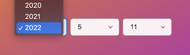

# react-ymd-date-select

[](https://github.com/whitphx/react-ymd-date-select/actions/workflows/main.yml)


Hooks and components for Y-M-D dropdowns with React. **[Demo](https://whitphx.github.io/react-ymd-date-select/)**



The Y-M-D dropdown UI is sometimes preferable to calendar widgets, e.g. birth date selection.

Building Y-M-D looks simple, but actually, there are some nuts;

- Generating the arrays of year, month, and day numbers and strings.
- Validating combinations of the Y-M-D values.
- Combining the 3 values from the dropdowns into one date value, and integrating it with the form component state.

This library manages these things.

## Installation

With npm:

```shell
npm install react-ymd-date-select
```

With Yarn:

```shell
yarn add react-ymd-date-select
```

## API & Samples

Please see [**the demo page**](https://whitphx.github.io/react-ymd-date-select/) for the guide and samples.

## Support the project

[](https://ko-fi.com/D1D2ERWFG)

<a href="https://www.buymeacoffee.com/whitphx" target="_blank"></a>

[](https://github.com/sponsors/whitphx)
